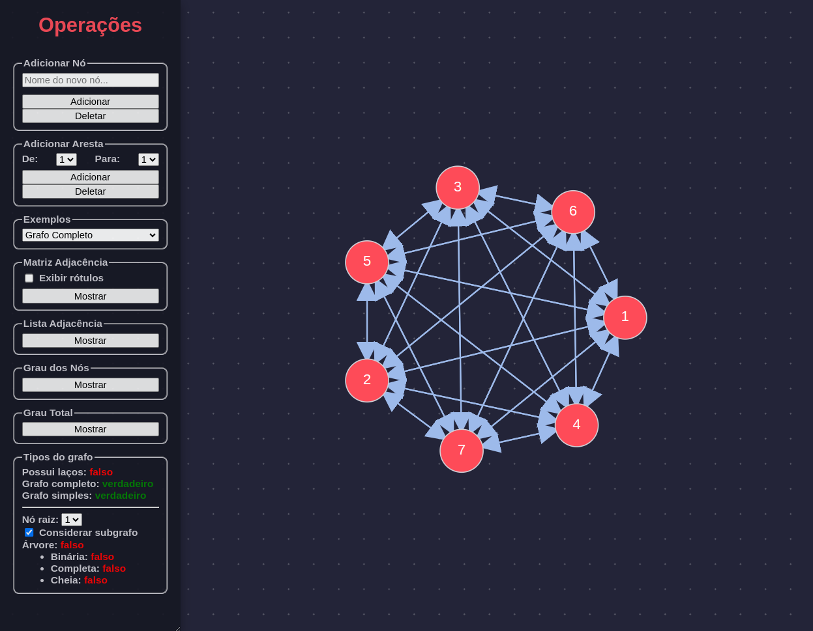

# atv_grafos
## Rodando o projeto
A única dependência deste projeto é a [linguagem de programação Go](https://go.dev/). Tendo instalado a linguagem, basta executar em um terminal:
```sh
go run .
```


